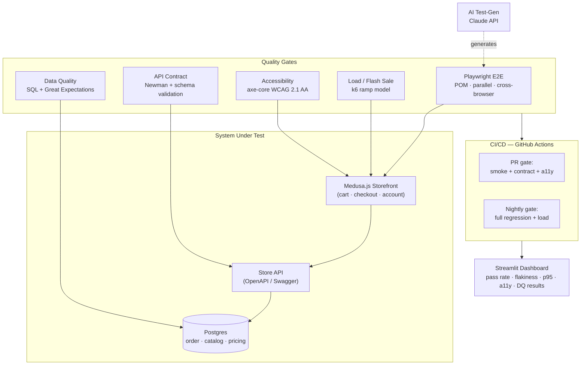

# Storefront Quality Gate Platform

> A QA **operations** platform for eCommerce — not a test repo. It manages a scalable Playwright library, wires quality gates into CI/CD, validates the **pricing, catalog, and order** systems at the database level, and load-tests the checkout funnel for peak traffic events.

Built to demonstrate that a QA engineer can be a **force multiplier**: the person who builds the infrastructure that lets an entire QA team move faster, not just the person who writes the next test.


---

## Why this project exists

On an eCommerce site, the nightmare scenario isn't a broken button — it's a **wrong price during a flash sale**, an **order that persists with an inconsistent state**, or a **checkout funnel that degrades under Black Friday load**. These are failures of *data integrity* and *system behavior under stress*, and most UI-level test suites never look that deep.

This platform tests a **real storefront** ([Medusa.js](https://medusajs.com/) with a live Postgres order database) across four layers of assurance, then gates every one of them in CI/CD so nothing ships without passing.

The differentiator: after every user-facing flow, the platform runs **warehouse-grade data-quality checks** against the order database. Price on the product page must equal price in the cart must equal price in the order must equal price in the database. Most QA stops at the UI. This doesn't.

---

## What it validates

| Layer | Tooling | What it proves |
|---|---|---|
| **End-to-end UI** | Playwright (Page Object Model, parallel, cross-browser) | Cart, checkout, and account management flows work for real users |
| **Backend / data quality** | SQL + Great Expectations | Pricing, catalog, and order-system integrity at the source of truth |
| **API contracts** | Postman/Newman + OpenAPI (Swagger) schema validation | Backend responses match their contract; no silent drift |
| **Performance / load** | k6 (LoadRunner-equivalent) | Checkout funnel holds p95/p99 under a simulated flash sale |
| **Accessibility** | axe-core + Playwright (WCAG 2.1 AA) | Consumer-facing pages are usable and compliant |
| **AI-assisted test-gen** | Claude API | Business acceptance criteria → Playwright test skeletons + data |

---

## JD → Feature map

This project was architected against a real QA Operations Engineer job description. Every requirement maps to a concrete, runnable component.

| Job requirement | Where it lives | How it's addressed |
|---|---|---|
| **Test Framework Architecture** — scale test libraries in Playwright for complex eCommerce (cart, checkout, account) | `src/framework/`, `tests/e2e/` | Reusable POM library with fixtures, data factories, and parallel execution — designed to be *adopted by a team*, not a flat spec folder |
| **Performance & Load Mastery** — LoadRunner for peak traffic | `tests/load/`, `docs/loadrunner-equivalency.md` | Flash-sale ramp model in k6, plus a LoadRunner competency-transfer map (VUsers↔VUs, Controller↔stages, Analysis↔Grafana) |
| **Backend & Data Quality** — API testing + SQL validation of pricing/catalog/order | `tests/api/`, `tests/data_quality/`, `sql/` | Contract tests + a Great Expectations suite asserting price/catalog/order integrity end-to-end at the DB |
| **CI/CD Integration** — tests in pipelines with DevOps | `.github/workflows/` | PR gates (smoke + contract + a11y), nightly gates (full regression + load), merge-blocking on failure |
| **Business Alignment** — translate business features into test strategy | `tools/ai-testgen/` | Claude-powered tool: paste a user story → generated Playwright skeletons, closing the gap between product intent and coverage |
| **Bonus: AI-assisted test generation** | `tools/ai-testgen/` | Same tool — one component satisfies two requirements |
| **Bonus: Accessibility testing** | `tests/accessibility/` | axe-core WCAG scans as a CI gate |

---

## Architecture



---

## The data-quality moat

This is the part that separates the project from a standard QA portfolio piece. After each purchase flow, the platform asserts integrity across the **three systems the role cares most about**:

**Pricing consistency**
```
price(product page) == price(cart) == price(order confirmation) == price(orders table in DB)
```
A discount that renders correctly on the PDP but writes the wrong value to the order line item is invisible to UI tests. It is caught here.

**Catalog referential integrity**
- Every order line item references a product that exists and is active
- No orphaned line items; no orders referencing deleted variants
- Inventory decrements exactly once per purchased unit

**Order state-machine consistency**
- Order status transitions follow legal paths (e.g. no `captured` without `authorized`)
- Totals reconcile: `sum(line items) + tax + shipping == order total`
- No orphaned or duplicated payment records

These run as a Great Expectations suite backed by parameterized SQL in `sql/validations/`, so they are both human-readable (for business partners) and enforceable (in CI).

---

## Repository structure

```
storefront-gate-platform/
├── src/framework/          # Reusable Playwright library (the "force multiplier")
│   ├── pages/              #   Page Object Model
│   ├── fixtures/           #   Auth, test data, DB connection fixtures
│   └── utils/              #   Data factories, price helpers, DB client
├── tests/
│   ├── e2e/                # Cart, checkout, account UI flows
│   ├── api/                # Postman/Newman + OpenAPI contract tests
│   ├── data_quality/       # Great Expectations suite (price/catalog/order)
│   ├── accessibility/      # axe-core WCAG scans
│   └── load/               # k6 flash-sale ramp model
├── sql/validations/        # Parameterized integrity SQL
├── great_expectations/     # GE project config + expectation suites
├── tools/ai-testgen/       # Claude-powered story→test generator
├── dashboard/              # Streamlit quality dashboard
├── .github/workflows/      # PR + nightly CI gates
└── docs/
    └── loadrunner-equivalency.md
```

---

## Roadmap (phased)

Built in order of interview signal — Phase 1 alone tells the whole story.

**Phase 1 — Core gates (highest signal)**
- [ ] Playwright POM framework: cart, checkout, account
- [ ] SQL + Great Expectations data-quality suite (price/catalog/order)
- [ ] GitHub Actions PR gate (smoke + DQ), merge-blocking

**Phase 2 — Contracts & AI**
- [ ] Newman + OpenAPI schema validation
- [ ] Claude test-gen tool (story → Playwright skeleton)

**Phase 3 — Scale & visibility**
- [ ] k6 flash-sale load model + LoadRunner equivalency doc
- [ ] axe-core accessibility gate
- [ ] Streamlit dashboard (pass rate, flakiness, p95, a11y, DQ)

---

## A note on LoadRunner

The role names **LoadRunner** specifically. It's proprietary and not freely available, so the load layer is built in **k6**, with `docs/loadrunner-equivalency.md` mapping the concepts one-to-one (VUsers ↔ virtual users, Controller scenarios ↔ ramping stages, Analysis reports ↔ Grafana/summary output). The skill — modeling peak-traffic behavior, reading p95/p99 under stress, tuning ramp profiles — transfers directly; only the vendor UI differs.

---

## Getting started

```bash
# 1. Bring up the storefront under test
docker compose up -d            # Medusa.js + Postgres

# 2. Install
npm install                     # Playwright + Newman
pip install -r requirements.txt # Great Expectations, k6 runner, Streamlit

# 3. Run the gates
npx playwright test             # E2E
python -m tests.data_quality    # Data-quality suite
newman run tests/api/*.json     # Contract tests
k6 run tests/load/flash-sale.js # Load
```

---

## Author

**Sajan Singh Shergill** — M.S. Data Science, Pace University
SDET → Data Engineer. 3+ years architecting QA automation frameworks in fintech, now bringing warehouse-grade data quality to QA operations.

📧 sajansshergill.careers@gmail.com · 🔗 [linkedin.com/in/sajanshergill](https://linkedin.com/in/sajanshergill) · 🌐 [sajansshergill.github.io](https://sajansshergill.github.io)
